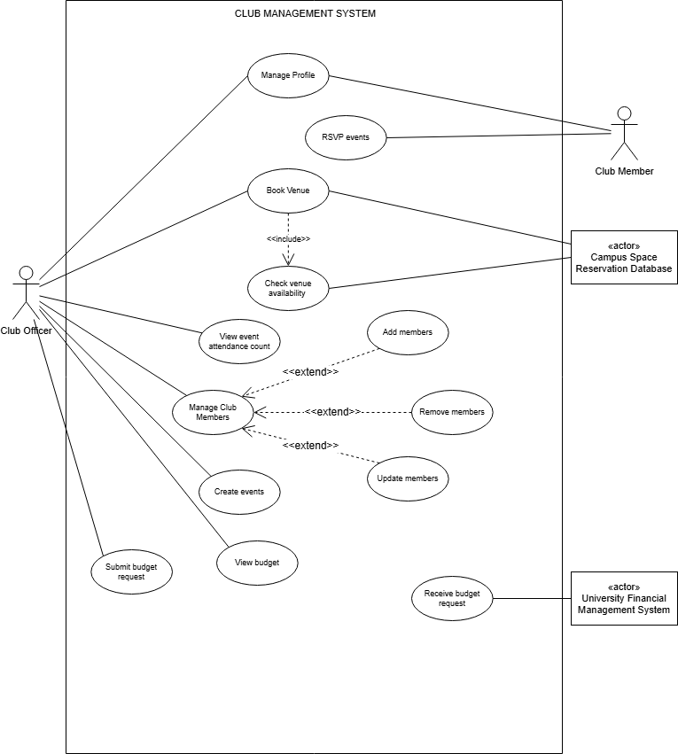
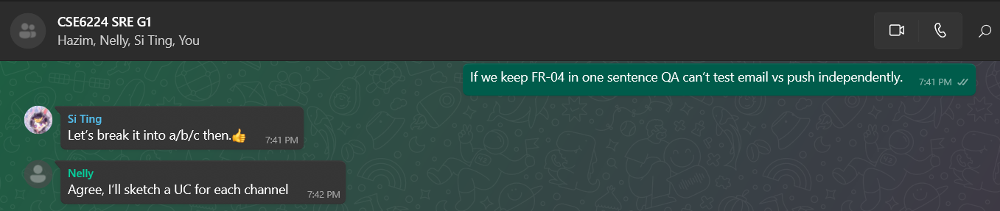
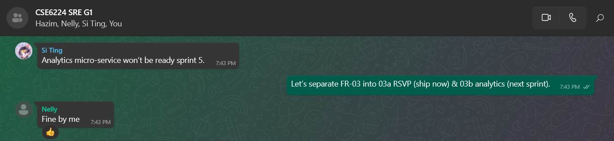
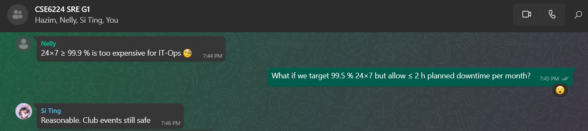
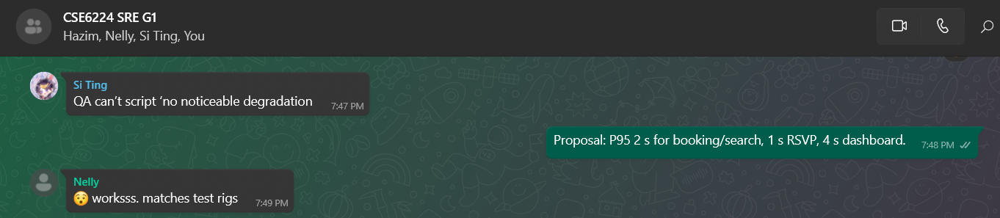
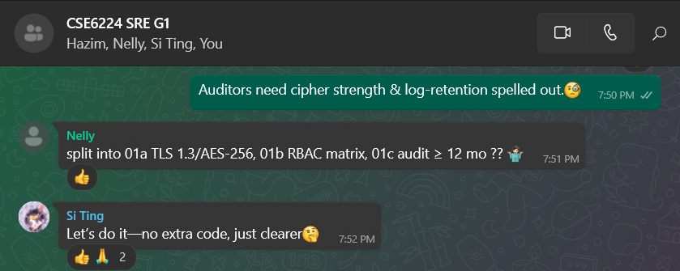

# Software Requirements Specification

**Project:** Student Club Management System with Budget and Venue Integration

**Version:** 1.0

**Date:** 2025-05-25

---

## Table of Contents

- [1 Introduction](#1-introduction)
  - [1.1 Purpose](#11-purpose)
  - [1.2 Scope](#12-scope)
  - [1.3 Product Overview](#13-product-overview)
    - [1.3.1 Product Perspective](#131-product-perspective)
    - [1.3.2 Product Functions](#132-product-functions)
    - [1.3.3 User Characteristics](#133-user-characteristics)
    - [1.3.4 Limitations](#134-limitations)
  - [1.4 Definitions](#14-definitions)
- [2 References](#2-references)
- [3 Requirements](#3-requirements)
  - [3.1 Functions](#31-functions)
    - [3.1.1 Club Officer](#311-club-officer)
      - [3.1.1.1 Manage Profile](#3111-manage-profile)
      - [3.1.1.2 Book Venue](#3112-book-venue)
      - [3.1.1.3 View Event Attendance Count](#3113-view-event-attendance-count)
      - [3.1.1.4 Manage Club Members](#3114-manage-club-members)
      - [3.1.1.5 Add Members](#3115-add-members)
      - [3.1.1.6 Remove Members](#3116-remove-members)
      - [3.1.1.7 Update Member Role](#3117-update-member-role)
      - [3.1.1.8 Create Events](#3118-create-events)
      - [3.1.1.9 View Budget](#3119-view-budget)
      - [3.1.1.10 Submit Budget Allocation Request](#31110-submit-budget-allocation-request)
    - [3.1.2 Club Member](#312-club-member)
      - [3.1.2.1 RSVP Events](#3121-rsvp-events)
    - [3.1.3 Campus Space Reservation Database](#313-campus-space-reservation-database)
      - [3.1.3.1 Check Venue Availability](#3131-check-venue-availability)
    - [3.1.4 University Financial Management System](#314-university-financial-management-system)
      - [3.1.4.1 Receive Budget Allocation Request](#3141-receive-budget-allocation-request)
  - [3.2 Performance Requirements](#32-performance-requirements)
  - [3.3 Usability Requirements](#33-usability-requirements)
  - [3.4 Interface Requirements](#34-interface-requirements)
  - [3.5 Logical Database Requirements](#35-logical-database-requirements)
    - [3.5.1 Types of Information Used by Various Functions](#351-types-of-information-used-by-various-functions)
    - [3.5.2 Frequency of Use](#352-frequency-of-use)
    - [3.5.3 Accessing Capabilities](#353-accessing-capabilities)
    - [3.5.4 Data Entities and Their Relationships](#354-data-entities-and-their-relationships)
    - [3.5.5 Integrity Constraints](#355-integrity-constraints)
    - [3.5.6 Database Security](#356-database-security)
    - [3.5.7 Data Retention Requirements](#357-data-retention-requirements)
  - [3.6 Design Constraints](#36-design-constraints)
  - [3.7 Software System Attributes](#37-software-system-attributes)
    - [3.7.1 Reliability](#371-reliability)
    - [3.7.2 Availability](#372-availability)
    - [3.7.3 Security](#373-security)
    - [3.7.4 Maintainability](#374-maintainability)
    - [3.7.5 Portability](#375-portability)
  - [3.8 Supporting Information](#38-supporting-information)
- [4 Verification](#4-verification)
  - [4.1 Verification Approach](#41-verification-approach)
  - [4.2 Verification Criteria](#42-verification-criteria)
- [5 Appendices](#5-appendices)
  - [5.1 Assumptions and Dependencies](#51-assumptions-and-dependencies)
  - [5.2 Acronyms and Abbreviations](#52-acronyms-and-abbreviations)

---

## 1 Introduction

The **Student Club Management System (SCMS)** is a web-based platform that unifies
membership administration, event scheduling, venue booking, and real-time
budget tracking for all recognised student clubs at Multimedia University (MMU).
It integrates seamlessly with the **University Financial Management System (UFMS)**
and the **Campus Space Reservation Database (CSRD)** to replace the current
patchwork of spreadsheets, e-mail threads, and manual forms encountered by club
officers today.

---

### 1.1 Purpose

- **Product purpose —** SCMS exists _to streamline every aspect of club
  management and operation_ by eliminating redundant paperwork, shortening
  approval cycles, and giving stakeholders a single dashboard for people, budgets,
  and venues.
- **Document purpose —** This SRS provides one authoritative reference for
  developers, testers, sponsors, and end-users, detailing the agreed functional
  and non-functional requirements in compliance with
  _ISO/IEC/IEEE 29148:2018_ [\[1\]](#ref-iso)

---

### 1.2 Scope

|             **Included capabilities**              |              **Explicit exclusions**               |
| :------------------------------------------------: | :------------------------------------------------: |
|           Membership CRUD & role control           | Handling personal banking data (delegated to UFMS) |
|          Event proposal, RSVP & analytics          |      Chat / instant messaging between members      |
|    Venue availability lookup & booking via CSRD    |               Non-university venues                |
| Budget workflow & ledger synchronisation with UFMS |             E-commerce ticket payments             |
|        E-mail / push / in-app notifications        |                                                    |

<em>Table 1.1 Project scope — included capabilities vs. explicit exclusions</em>

---

### 1.3 Product Overview

SCMS is delivered as a lightweight SaaS module hosted on the university’s
private cloud. It authenticates users through Single Sign-On (SSO) and
exposes REST APIs to UFMS and CSRD. **Figure 1.1** illustrates SCMS in
its operating context.

#### 1.3.1 Product Perspective — System Context Diagram

<figure>
  
  
<figcaption align="center"><strong>Figure 1.1</strong> SCMS context diagram.</figcaption>

</figure>

#### 1.3.2 Product Functions

|  ID  | Function                               | Primary actor |
| :--: | -------------------------------------- | :-----------: |
| F-01 | Maintain club membership & roles       | Club Officer  |
| F-02 | Create, submit & track event proposals | Club Officer  |
| F-03 | RSVP to events                         |  Club Member  |
| F-04 | Query & reserve campus venues          | Club Officer  |
| F-05 | Draft, submit & monitor club budgets   | Club Officer  |
| F-06 | Approve budgets & monitor spend        |     UFMS      |
| F-07 | Real-time alerts & reports             |   All roles   |

<em>Table 1.2 High-level product functions</em>

#### 1.3.3 User Characteristics

|  User group   |        Size / skill        |        Design-relevant traits        |
| :-----------: | :------------------------: | :----------------------------------: |
| Club Members  | ≈ 6,000; basic IT literacy |             Mobile-first             |
| Club Officers |   ≈ 1,000; intermediate    | Need dashboards, bulk ops, approvals |

<em>Table 1.3 Primary user groups and crucial characteristics</em>

#### 1.3.4 Limitations

- **Regulatory** – MMU data privacy policy enforced.
- **Operational** – Supports only university venues.
- **Security** – Role-based access control, full audit logging.

---

### 1.4 Definitions

| Term / Acronym | Definition |
| :-------------: | :--------- |
| **API** | *Application Programming Interface* — a set of rules and protocols for building and interacting with software applications. |
| **Budget Ledger Entry** | Financial transaction record automatically posted from SCMS to UFMS once a budget item is approved. |
| **Club Member** | Ordinary student member of a club; may maintain a personal profile and RSVP to approved events. |
| **Club Officer** | Elected committee member (e.g., President, Secretary, Treasurer) authorised to manage club data, events, and budgets in SCMS. |
| **CRUD** | *Create, Read, Update, Delete* — basic data-management operations supported by SCMS modules. |
| **Docker** | Containerisation platform used to package and deploy SCMS services. |
| **Event Proposal** | Formal request that specifies a club activity, expected costs, and required venue; subject to multi-level approval. |
| **FCM** | *Firebase Cloud Messaging* — cross-platform messaging solution for sending notifications. |
| **KPI** | *Key Performance Indicator* — a quantifiable measure used to evaluate the success of an activity. |
| **OAuth 2.0** | Open standard for delegated authorisation used by the university SSO. |
| **RBAC** | *Role-Based Access Control* — permission model that restricts actions based on user role. |
| **REST** | *Representational State Transfer* — architectural style for stateless web APIs. |
| **RSVP** | *Répondez s’il vous plaît* — confirmation from a member indicating event attendance. |
| **SCMS** | *Student Club Management System* — the software product described in this SRS. |
| **SMTP** | *Simple Mail Transfer Protocol* — internet standard for e-mail transmission. |
| **SSO** | *Single Sign-On* — authentication mechanism allowing users to access multiple university systems with one set of credentials. |
| **TLS** | *Transport Layer Security* — cryptographic protocol providing secure communication over a network. |
| **UFMS** | *University Financial Management System* — MMU’s finance solution that processes budget allocations and ledger entries. |
| **Venue Reservation ID** | Unique identifier returned by CSRD confirming a successful room or space booking. |
| **WCAG** | *Web Content Accessibility Guidelines* — W3C standard for web accessibility. |

<em>Table 1.4 Definitions, acronyms, and abbreviations used in this SRS</em>

---

## 2 References

1. International Organization for Standardization, International Electrotechnical Commission, & Institute of Electrical and Electronics Engineers. (2018). *Systems and software engineering—Life cycle processes—Requirements engineering* (ISO/IEC/IEEE 29148:2018). https://doi.org/10.1109/IEEESTD.2018.8559686  
2. Internet Engineering Task Force. (2012). *The OAuth 2.0 authorization framework* (RFC 6749). https://doi.org/10.17487/RFC6749  
3. World Wide Web Consortium. (2018). *Web Content Accessibility Guidelines (WCAG) 2.1*. https://www.w3.org/TR/WCAG21/  
4. Docker Inc. (2024). *Docker Desktop user manual* (Version 4.30). https://docs.docker.com/desktop/  
5. Google. (2025). *Firebase Cloud Messaging documentation*. https://firebase.google.com/docs/cloud-messaging  
6. Multimedia University. (2024). *University IT security & data-retention policy* (Version 2.3). https://intranet.mmu.edu.my/policies/it-security  

---

## 3 Requirements

### 3.1 Functions

<figure>
  
  
<figcaption align="center"><strong>Figure 3.0</strong> Use Case Diagram.</figcaption>

</figure>

| ID      | Requirement Description                                                                                                                                                                   | Use Case ID(s) | Use Case(s)                                                                 |
| ------- | ----------------------------------------------------------------------------------------------------------------------------------------------------------------------------------------- | -------------- | --------------------------------------------------------------------------- |
| FR‑01   | The system shall enable members to view and update their personal profile.                                                                                                                | UC001          | Manage Profile                                                              |
| FR-02a    | The system shall integrate with the Campus Space Reservation Database to **check venue availability** before a booking is attempted.           | UC012         | Check Venue Availability                    |
| FR-02b    | The system shall integrate with the Campus Space Reservation Database to **submit venue booking requests** for an available slot.              | UC002         | Book Venue                                  |
| FR-03a    | The system shall allow Club Members to **submit RSVPs** for published events in real time.                                                     | UC011         | RSVP Events                                 |
| FR-03b    | The system shall provide Club Officers with a **live attendance count** for each event.                                                        | UC003         | View Event Attendance Count                 |
| FR-04a    | The system shall send **email notifications** (approval / rejection / action-required) for event proposals, budget requests, and venue bookings to relevant users. | UC014         | Receive System Notifications                |
| FR-04b    | The system shall send **push notifications** (via FCM) covering approval, rejection, or action-required statuses for event proposals, budget requests, and venue bookings. | UC014         | Receive System Notifications                |
| FR-04c    | The system shall show **in-app notifications** within the SCMS UI for approval, rejection, or action-required statuses on proposals, budgets, and bookings. | UC014         | Receive System Notifications                |         |
| FR‑05 a | The system shall allow club officers to add new members in the club.                                                                                                                      | UC005          | Add Members                                                                 |
| FR‑05 b | The system shall allow club officers to remove members in the club.                                                                                                                       | UC006          | Remove Members                                                              |
| FR‑05 c | The system shall allow club officers to update members details in the club.                                                                                                               | UC007          | Update Member Role                                                          |
| FR‑06   | The system shall allow club officers to create and plan events for all club members.                                                                                                      | UC008          | Create Events                                                               |
| FR‑07   | The system shall allow club officers to submit budget allocation requests to the university’s finance system without approval capability. Approval decisions reside solely with the UFMS. | UC010,UC013    | 1. Submit Budget Allocation Request 2. Receive Budget Allocation Request |
| FR‑08   | The system shall allow club officers to track budget and spending.                                                                                                                        | UC009          | View Budget                                                                 |

<em>Table 3.1 Functional requirements and their associated use cases</em>

#### 3.1.1 Club Officer

A club officer role in the system is to manages club operations, those include:
 1. creating and managing events.  2. submitting budget requests.  3. track managed club budget and spendings.  4. maintaining member records(adding,removing or updating their role).  5.Track event attendance.

##### 3.1.1.1 Manage Profile

| _Section_         | _Content_                                                                                                                                    |
| ----------------- | -------------------------------------------------------------------------------------------------------------------------------------------- |
| Use Case ID       | UC001                                                                                                                                        |
| Name              | Manage profile                                                                                                                               |
| Author            | Adeeb Darwisy                                                                                                                                |
| Source            | The system shall enable members to view and update their personal profile [FR-01].                                                           |
| Short Description | The club officer can personalize their own personal profile by editing their information like name, email, address, etc., within the system. |
| Goals             | Allow users to view and update their profile information like name, email, address, etc., in the system.                                     |
| Actors            | 1. Club Officer                                                                                                                              |
| Pre-conditions    | 1. The users must be logged into the system. 2. The users must have access rights to edit their own profile.                              |
| Post-conditions   | 1. The user's updated profile information is successfully saved in the system. 2. The changes are reflected in the user's profile view.   |
| Main flow   | 1. The club officer clicks on “update profile”. 2.	The system fetches the current profile and loads it. 3.	The system displays the current profile to the user. 4. If changes were made to the profile, the system validates the new entered data. 5. If found valid, save into system and update the profile accordingly, show “profile updated” message.    |
| Alternative flow   | •	If changes made were not valid, the system highlights the errors to the user. •	If there were no changes were made; system returns to main page. • If the system is not able to retrieve data from the database currently; it will display error message.   |

<em>Table 3.2 Use Case Specification - Manage Profile</em>

<figure>
  
  
<figcaption align="center"><strong>Figure 3.1</strong> Activity Diagram - Manage Profile.</figcaption>

</figure>

##### 3.1.1.2 Book Venue

| _Section_         | _Content_                                                                                                                          |
| ----------------- | ---------------------------------------------------------------------------------------------------------------------------------- |
| Use Case ID       | UC002                                                                                                                              |
| Name              | Book venue                                                                                                                         |
| Author            | Adeeb Darwisy                                                                                                                      |
| Source            | The system shall integrate with the campus venue reservation system to check availability and submit booking request [FR-02].      |
| Short Description | The club officer can book venues and check venue availability through the campus space reservation database.                       |
| Goals             | 1. Enable club officer to search for available venues. 2. Allow the club officer to submit booking requests.                    |
| Actors            | 1. Club Officer 2. Campus Space Reservation Database                                                                            |
| Pre-conditions    | 1. The club officer is logged into the system. 2. The club officer has permissions to check venue availability and book venues. |
| Post-conditions   | 1. Booking request is successfully recorded. 2. Confirmation or status is shown to the club officer.                            |
| Main flow   | 1.	The club officer enters the event and venue preferences. 2.	The system will check for venue availability. 3.	if found available, the system asks the club officer to submit the booking request. 4. The system will return a booking ID and notify all relevant stake holders.|
| Alternative flow   |• If the selected venue is already booked, the system notifies the user and shows alternative time slots or venues. •	If no venue was found available, the system will notify the user and prompt for a new slot/ venue. •	If the system is not able to retrieve data from the database currently; it will display an error message.  |

<em>Table 3.3 Use Case Specification - Book Venue</em>

<figure>
  
  
<figcaption align="center"><strong>Figure 3.2</strong> Activity Diagram - Book Venue.</figcaption>

</figure>

##### 3.1.1.3 View Event Attendance Count

| Section           | Content                                                                                 |
| ----------------- | --------------------------------------------------------------------------------------- |
| Use Case ID       | UC003                                                                                   |
| Name              | View event attendance count                                                             |
| Author            | Keshaav                                                                                 |
| Source            | The system shall track member RSVPs and provide attendee counts in real time [FR-03].   |
| Short Description | Allows the Club Officer to view the number of members who attended a specific event.    |
| Goals             | To monitor event participation for planning and reporting purposes.                     |
| Actors            | Club Officer                                                                            |
| Pre-conditions    | 1. The Club Officer is logged into the system. 2. Event records exist in the system. |
| Post-conditions   | 1. Attendance count is displayed for the selected event.                                |
| Main flow   | 1.	The club officer picks an event they wish to monitor. 2.	The system fetches the RSVP list . 3.	The system fetches the check-in scans. 4.	The system computes the total counts. 5.	The system renders chart/summary about the event with the data.|
| Alternative flow   |•	If the selected event does not exist in the system. •	If the system is not able to retrieve data from the database currently; it will display an error message. |

<em>Table 3.4 Use Case Specification - View Event Attendance Count</em>

<figure>
  
  
<figcaption align="center"><strong>Figure 3.3</strong> Activity Diagram - View Event Attendance Count.</figcaption>

</figure>

##### 3.1.1.4 Manage Club Members

| **Section**       | **Content**                                                                                                         |
| ----------------- | ------------------------------------------------------------------------------------------------------------------- |
| Use Case ID       | UC004                                                                                                               |
| Name              | Manage club members                                                                                                 |
| Author            | Abdullah Hawash                                                                                                     |
| Source            | The system shall allow club officers to add, remove, and update members and control their role in the club [FR-05]. |
| Short Description | The club officer views and maintains the roster, initiating add, remove, or role-update actions as required.        |
| Goals             | Keep an accurate, up-to-date list of members for administration and event planning.                                 |
| Actors            | Club Officer                                                                                                        |
| Pre-conditions    | 1. Officer is authenticated and authorised for membership management. 2. Target club is active.                  |
| Post-conditions   | 1. Membership roster is updated to reflect any changes. 2. Audit log records the action.                         |
| Main flow   |1.	The club officer selects “member management action”. 2.	The system loads three distinct options to choose from, add members, remove members and update member role. 3.	The club officer picks an option currently. 4.	The system loads the selected module. 5.	The system validates the input and performs the requested action. 6.	A confirmation message is displayed.|
| Alternative flow   |Cancel Action •	At any point before submitting the form, the officer may cancel the operation. •	The system discards any entered data and returns to the member management menu.|

<em>Table 3.5 Use Case Specification - Manage Club Members</em>

<figure>
  
  
<figcaption align="center"><strong>Figure 3.4</strong> Activity Diagram - Manage Club Members.</figcaption>

</figure>

##### 3.1.1.5 Add Members

| **Section**       | **Content**                                                                                                         |
| ----------------- | ------------------------------------------------------------------------------------------------------------------- |
| Use Case ID       | UC005                                                                                                               |
| Name              | Add members                                                                                                         |
| Author            | Abdullah Hawash                                                                                                     |
| Source            | The system shall allow club officers to add, remove, and update members and control their role in the club [FR-05]. |
| Short Description | The club officer enrolls a new student into the club’s roster.                                                      |
| Goals             | Register a qualified student and assign the default Club Member role.                                               |
| Actors            | Club Officer                                                                                                        |
| Pre-conditions    | 1. Officer is authenticated. 2. Student is not already on the roster. 3. Club has capacity for new members.   |
| Post-conditions   | 1. New member record is created in the system. 2. Welcome notification is sent to new member.                    |
| Main flow   |1.	The club officer navigates to “Manage Club Members”. 2.	The club officer clicks on “Add members”. 3.	The system displays a form for the club officer to fill with the new member details, name, id, email and role. 4.	The system will record the input , validate the new member information and perform the requested action. 5.	A confirmation message is displayed. 6.	The system will then send a welcome notification to the new user email.|
| Alternative flow   |Cancel Action •	At any point before submitting the form, the officer may cancel the operation. •	The system discards any entered data and returns to the member management menu. Duplicate Entry •	If the officer attempts to add a member who already exists in the club database: a. The system alerts the officer about the duplicate. b. The officer may choose to update the existing member's information or cancel the action. Unable to write to the database •	If the system is unable to connect to the database and write the new user to it. •	The system will notify the user about the error and ask to try again later.|

<em>Table 3.6 Use Case Specification - Add Members</em>

<figure>
  
  
<figcaption align="center"><strong>Figure 3.5</strong> Activity Diagram - Add Members.</figcaption>

</figure>

##### 3.1.1.6 Remove Members

| **Section**       | **Content**                                                                                                                                         |
| ----------------- | --------------------------------------------------------------------------------------------------------------------------------------------------- |
| Use Case ID       | UC006                                                                                                                                               |
| Name              | Remove members                                                                                                                                      |
| Author            | Abdullah Hawash                                                                                                                                     |
| Source            | The system shall allow club officers to add, remove, and update members and control their role in the club [FR-05].                                 |
| Short Description | The club officer removes an existing member from the roster.                                                                                        |
| Goals             | Ensure former members no longer have access or voting rights while preserving historical data.                                                      |
| Actors            | Club Officer                                                                                                                                        |
| Pre-conditions    | 1. Officer is authenticated. 2. Member to be removed exists on the roster.                                                                       |
| Post-conditions   | 1. Member record is marked as inactive or removed (as per data retention policy DRR-04) in the system. 2. Removal action is logged for auditing. |
| Main flow   |1.	The club officer navigates to “Manage Club Members”. 2.	The club officer clicks on “Remove Members”. 3.	The system prompts the club officer to search / select a member to remove. 4.	The system will record the input , validate the with the club member database and perform the requested action. 5.	A confirmation message is displayed.|
| Alternative flow   |Cancel Action •	At any point before submitting the form, the officer may cancel the operation. •	The system discards any entered data and returns to the member management menu. Non-existent Entry •	If the officer tries to remove a member not found in the database: a. The system notifies the officer. b. The officer may re-enter the member information or return to the main menu. Unable to write to the database •	If the system is unable to connect to the database and write the new user to it. •	The system will notify the user about the error and ask to try again later.|

<em>Table 3.7 Use Case Specification - Remove Members</em>

<figure>
  
  
<figcaption align="center"><strong>Figure 3.6</strong> Activity Diagram - Remove Members.</figcaption>

</figure>

##### 3.1.1.7 Update Member Role

| **Section**       | **Content**                                                                                                         |
| ----------------- | ------------------------------------------------------------------------------------------------------------------- |
| Use Case ID       | UC007                                                                                                               |
| Name              | Update member role                                                                                                  |
| Author            | Abdullah Hawash                                                                                                     |
| Source            | The system shall allow club officers to add, remove, and update members and control their role in the club [FR-05]. |
| Short Description | The club officer changes the role or permission level of an existing member.                                        |
| Goals             | Reflect accurate role assignments in line with club hierarchy and responsibilities.                                 |
| Actors            | Club Officer                                                                                                        |
| Pre-conditions    | 1. Officer is authenticated. 2. Target member exists on the roster. 3. Desired role is valid.                 |
| Post-conditions   | 1. Member’s role is updated in the system. 2. Member is notified of the role change.                             |
| Main flow   |1.	The club officer navigates to “Manage Club Members”. 2.	The club officer clicks on “Update  Member Role ”. 3.	The system prompts the club officer to search / select a member to update.  4.	The club officer selects the new assigned role from a drop-down menu. 5.	The system will record the input , validate the with the club member database and perform the requested action. 6.	A confirmation message is displayed. 7.	The member is notified of the change.|
| Alternative flow   |Cancel Action •	At any point before submitting the form, the officer may cancel the operation. •	The system discards any entered data and returns to the member management menu. Unable to write to the database •	If the system is unable to connect to the database and write the new user to it. •	The system will notify the user about the error and ask to try again later.|

<em>Table 3.8 Use Case Specification - Update Member Role</em>

<figure>
  
  
<figcaption align="center"><strong>Figure 3.7</strong> Activity Diagram - Update Member Role.</figcaption>

</figure>

##### 3.1.1.8 Create Events

| Section           | Content                                                                                                                      |
| ----------------- | ---------------------------------------------------------------------------------------------------------------------------- |
| Use Case ID       | UC008                                                                                                                        |
| Name              | Create events                                                                                                                |
| Author            | Keshaav                                                                                                                      |
| Source            | The system shall allow club officers to plan and create events for all club members [FR-06].                                 |
| Short Description | Enables a Club Officer to create and schedule a new event, including details such as title, date, description, and location. |
| Goals             | To allow clubs to plan and organize events efficiently.                                                                      |
| Actors            | Club Officer                                                                                                                 |
| Pre-conditions    | 1. The Club Officer is logged into the system. 2. Event form inputs are available.                                        |
| Post-conditions   | 1. New event is added and stored in the system. 2. Event is visible to Club Officer and club members.                     |
| Main flow   |1.	The club officer selects “Create Event” option. 2.	The system displays a form, asking the club officer to enter relevant event information (name, date, time, description). 3.	The system will check for venue availability. 4.	The system will record the input , validate the with the venue and perform the requested action. 5.	The system will then submit the event creation request. 6.	The event gets stored in the system. 7.	The relevant stakeholders are notified about the event.|
| Alternative flow   |Cancel Action •	At any point before submitting the form, the officer may cancel the operation. •	The system discards any entered data and returns to the member management menu. Venue not available •	If the selected venue is not available for booking •	The system displays a message and prompts the user to select a new venue or another time to resolve the conflict.|

<em>Table 3.9 Use Case Specification - Create Events</em>

<figure>
  
  
<figcaption align="center"><strong>Figure 3.8</strong> Activity Diagram - Create Events.</figcaption>

</figure>

##### 3.1.1.9 View Budget

| Section           | Content                                                                                          |
| ----------------- | ------------------------------------------------------------------------------------------------ |
| Use Case ID       | UC009                                                                                            |
| Name              | View budget                                                                                      |
| Author            | Keshaav                                                                                          |
| Source            | The system shall allow club officers to track budget and spending [FR-08].                       |
| Short Description | Lets a Club Officer check the club's current budget allocation and spending status.              |
| Goals             | To allow club officers to track financial resources and manage fund utilization.                 |
| Actors            | Club Officer                                                                                     |
| Pre-conditions    | 1. The Club Officer is logged into the system. 2. Budget records are available in the system. |
| Post-conditions   | 1. Budget overview is displayed.                                                                 |
| Main flow   |1.	The club officer navigates to “View Budget” 2.	The system fetches the current budget details form the UFMS. 3.	The system displays the managed club budget information (allocated, spent, remaining)|
| Alternative flow   |•	If the system does not find any budget records for the club: a. The system displays a message indicating that no budget data is currently available. b. The officer may choose to return to the main menu or retry later. •	If the system is not able to retrieve data from the database currently; it will display an error message.|

<em>Table 3.10 Use Case Specification - View Budget</em>

<figure>
  
  
<figcaption align="center"><strong>Figure 3.9</strong> Activity Diagram - View Budget.</figcaption>

</figure>

##### 3.1.1.10 Submit Budget Allocation Request

| **Section**       | **Content**                                                                                                                                                        |
| ----------------- | ------------------------------------------------------------------------------------------------------------------------------------------------------------------ |
| Use Case ID       | UC010                                                                                                                                                              |
| Name              | Submit budget allocation request                                                                                                                                   |
| Author            | Harris Majeed                                                                                                                                                      |
| Source            | The system shall allow club officers to seamlessly submit budget allocation requests to the university’s finance system [FR-07].                                   |
| Short Description | The club officer submits the request for UFMS to review, the amount they would like to request with optional supporting documents, and submits the budget request. |
| Goals             | Allows the club officer to request for budget to conduct club activities.                                                                                          |
| Actors            | Club Officer                                                                                                                                                       |
| Pre-conditions    | 1. The club officer must be authenticated.                                                                                                                         |
| Post-conditions   | 1. The budget allocation request is sent to the university's financial management system for approval.                                                             |
| Main flow   |1.	The club officer navigates to “Submit Budget Allocation” 2.	The system displays a form for the club officer to fill. 3.	The club officer enters the purpose, and the amount requested 4.	If applicable the club officer can also attach supporting documents 5.	The system submits the request to the UFMS 6.	The system stores the submitted request.|
| Alternative flow   |Cancel Action •	At any point before submitting the form, the officer may cancel the operation. •	The system discards any entered data and returns to the event creation menu. System unavailability  •	If the system is not able to contact the UFMS; it will display an error message, prompting the user to try at a later time.|

<em>Table 3.11 Use Case Specification - Submit Budget Allocation Request</em>

<figure>
  
  
<figcaption align="center"><strong>Figure 3.10</strong> Activity Diagram - Submit Budget Allocation Request.</figcaption>

</figure>

#### 3.1.2 Club Member

Participates in club activities, can RSVP to events, and view personal and club-related information.

##### 3.1.2.1 Manage Profile

| _Section_         | _Content_                                                                                                                                   |
| ----------------- | ------------------------------------------------------------------------------------------------------------------------------------------- |
| Use Case ID       | UC001                                                                                                                                       |
| Name              | Manage profile                                                                                                                              |
| Author            | Adeeb Darwisy                                                                                                                               |
| Source            | The system shall enable members to view and update their personal profile [FR-01].                                                          |
| Short Description | The club member can personalize their own personal profile by editing their information like name, email, address, etc., within the system. |
| Goals             | Allow users to view and update their profile information like name, email, address, etc., in the system.                                    |
| Actors            | 1. Club Member                                                                                                                              |
| Pre-conditions    | 1. The users must be logged into the system. 2. The users must have access rights to edit their own profile.                             |
| Post-conditions   | 1. The user's updated profile information is successfully saved in the system. 2. The changes are reflected in the user's profile view.  |
| Main flow   |1.	The club member clicks on “update profile”. 2.	The system fetches the current profile and loads it. 3.	The system displays the current profile to the user. 4.	If changes were made to the profile, the system validates the new entered data. 5.	If found valid, save into system and update the profile accordingly, show “profile updated” message.  |
| Alternative flow   |•	If changes made were not valid, the system highlights the errors to the user. •	If there were no changes were made; system returns to main page. •	If the system is not able to retrieve data from the database currently; it will display error message.|

<em>Table 3.2 Use Case Specification - Manage Profile</em>

<figure>
  
  
<figcaption align="center"><strong>Figure 3.1</strong> Activity Diagram - Manage Profile.</figcaption>

</figure>

##### 3.1.2.2 RSVP Events

| _Section_         | _Content_                                                                                                                                                    |
| ----------------- | ------------------------------------------------------------------------------------------------------------------------------------------------------------ |
| Use Case ID       | UC011                                                                                                                                                        |
| Name              | RSVP events                                                                                                                                                  |
| Author            | Adeeb Darwisy                                                                                                                                                |
| Source            | The system shall track member RSVPs and provide attendee counts in real time [FR-03].                                                                        |
| Short Description | Allows club member to submit RSVP response for events to the system and provide attendance counts.                                                           |
| Goals             | Allow club member to RSVP for events and provide accurate attendance tracking.                                                                               |
| Actors            | Club Member                                                                                                                                                  |
| Pre-conditions    | 1. The club member is logged into the system. 2. The event must be created and available for RSVP.                                                        |
| Post-conditions   | 1. The RSVP request is saved in the system. 2. The event's attendance count is updated. 3. The club member receives a confirmation of successful RSVP. |
| Main flow   |1.	The system list down the upcoming events  2.	The club member selects an event  3.	The system checks and compares with the current capacity 4.	The system inserts RSVP  5.	The system sends a confirmation to the club member via e-mail.|
| Alternative flow   |Already RSVPed •	If the club member already RSVPed to the selected event, the system offers a cancel option. Over capacity limit. •	If the selected event capacity reached limit, display a message stating that the event is full.|

<em>Table 3.12 Use Case Specification - RSVP Events</em>

<figure>
  
  
<figcaption align="center"><strong>Figure 3.11</strong> Activity Diagram - RSVP Events.</figcaption>

</figure>

#### 3.1.3 Campus Space Reservation Database

An external system that stores and manages data on available campus venues and their booking statuses.

##### 3.1.3.1 Check Venue Availability

| _Section_         | _Content_                                                                                                                                                            |
| ----------------- | -------------------------------------------------------------------------------------------------------------------------------------------------------------------- |
| Use Case ID       | UC012                                                                                                                                                                |
| Name              | Check venue availability                                                                                                                                             |
| Author            | Adeeb Darwisy                                                                                                                                                        |
| Source            | The system shall integrate with the campus venue reservation system to check availability and submit booking request [FR-02].                                        |
| Short Description | The campus space reservation database will provide venue availability to club officers and store information regarding venue reservations.                           |
| Goals             | 1. Provide real-time venue availability information. 2. Support the booking process by storing and retrieving reservation data.                                   |
| Actors            | club officer                                                                                                                                                         |
| Pre-conditions    | 1. The system is connected to the campus space reservation database. 2. Club officer initiates a venue availability check.                                        |
| Post-conditions   | 1. Venue availability status is returned to the club officer. 2. Reservations are recorded in the database. 3. Availability status is updated in the database. |
| Main flow   |1.	The system fetches the date/time and requirements 2.	The system validates the parameters  3.	If valid, the system queries the campus reservation DB and check for slots 4.	If a slot is found, display the available venues.|
| Alternative flow   |Invalid Parameters •	If the parameters are invalid, the system will show the validation errors and wait for a re-input. No slots were found. •	If there were no slots available after querying the campus reservation DB, the system displays the message “No venues available”.|

<em>Table 3.13 Use Case Specification - Check Venue Availability</em>

<figure>
  
  
<figcaption align="center"><strong>Figure 3.12</strong> Activity Diagram - Check Venue Availability.</figcaption>

</figure>

#### 3.1.4 University Financial Management System

An external financial system that handles budget allocation, fund approval, and financial tracking for university-related activities.

##### 3.1.4.1 Receive Budget Allocation Request

| **Section**       | **Content**                                                                                                                                                       |
| ----------------- | ----------------------------------------------------------------------------------------------------------------------------------------------------------------- |
| Use Case ID       | UC013                                                                                                                                                             |
| Name              | Receive budget allocation request                                                                                                                                 |
| Author            | Harris Majeed                                                                                                                                                     |
| Source            | The system shall allow club officers to submit budget allocations via authenticated API connection to the university finance system requests [FR-07]. |
| Short Description | The university's financial management system approves/denies a budget allocation request, and club officers are notified of the decision.                         |
| Goals             | Allows club officers to be aware of budget approval decisions made by the finance department.                                                                     |
| Actors            | University Financial Management System                                                                                                                            |
| Pre-conditions    | 1. A budget allocation request had been made. 2. The university financial management system has made a decision.                                               |
| Post-conditions   | 1. Club Officers are notified of the decision. 2. If approved, the club ledger is updated. 3. If denied, a denial reason is logged.                         |
| Main flow   |1.	The system receives budget allocation decision. 2.	The system verifies the message authenticity. 3.	If found valid, the system updates the club budget ledger 4.	Notifies the club officers of the decision.|
| Alternative flow   |Invalid message  •	If the message was found invalid, the system logs the invalid message error and exits. Budget request denied  •	If the budget request was denied, the system logs the denial reason and notify the club officers of the denial.|

<em>Table 3.14 Use Case Specification - Receive Budget Allocation Request</em>

<figure>
  
  
<figcaption align="center"><strong>Figure 3.13</strong> Activity Diagram - Receive Budget Allocation Request.</figcaption>

</figure>

### 3.2 Performance Requirements

| Performance Requirements ID | Description                                                                                                | Priority | Author        |
| --------------------------- | ---------------------------------------------------------------------------------------------------------- | -------- | ------------- |
| PR-01 | The system shall sustain **500 concurrent authenticated users** executing a representative mix of actions (70 % read / 30 % write) while maintaining **≤ 2 s page-level P95 response time** for venue search, venue-booking submit, RSVP POST, budget dashboard load, and profile edit. | High | Adeeb Darwisy |
| PR-02 | Under normal load (< 100 concurrent users) the system shall complete a **full login round-trip** (SSO redirect → dashboard fully rendered) in **≤ 1 s P95 and ≤ 1.5 s worst-case**. | High | Adeeb Darwisy |

<em>Table 3.15 Performance requirements</em>

---

### 3.3 Usability Requirements

| Usability Requirements ID | Description                                                                                                                                                         | Priority | Author        |
| ------------------------- | ------------------------------------------------------------------------------------------------------------------------------------------------------------------- | -------- | ------------- |
| UR-01 | Users shall complete any of the three primary tasks (Submit RSVP, Book Venue, View Dashboard) with **≤ 3 navigation actions** (click / tap / key-press) from the landing page, and **≥ 90 % of test participants shall succeed on first attempt** in usability testing. | High | Adeeb Darwisy |
| UR-02 | The interface shall provide localisation for **English and Malay** with **≥ 95 % of user-visible strings translated** and a **user-selectable language toggle** in profile settings; untranslated fallback strings must not exceed 5 % per release. | High | Adeeb Darwisy |

<em>Table 3.16 Usability requirements</em>

---

### 3.4 Interface Requirements

| Interface Requirements ID | Description                                                                                                                                | Priority | Author        |
| ------------------------- | ------------------------------------------------------------------------------------------------------------------------------------------ | -------- | ------------- |
| INT-01                    | The system shall integrate with the University Financial Management System to submit and retrieve budget proposal data.                    | High     | Harris Majeed |
| INT-02                    | The system shall integrate with the University Financial Management System to automatically reflect approved budgets in financial records. | High     | Harris Majeed |
| INT-03                    | The system shall be integrated with the Campus Space Reservation Database to check venue availability.                                     | High     | Harris Majeed |
| INT-04                    | The system shall be integrated with the Campus Space Reservation Database to submit and track booking requests.                            | High     | Harris Majeed |
| INT-05                    | The web interface shall include a dashboard for club officers with budget and event summaries.                                             | High     | Harris Majeed |
| INT-06                    | The web interface shall include a calendar interface for managing events and bookings.                                                     | High     | Harris Majeed |
| INT-07                    | The web interface shall include a notification panel for alerts (push/email).                                                              | High     | Keshaav       |
| INT-08                    | User interface elements shall include a top navigation bar.                                                                                | Medium   | Keshaav       |
| INT-09                    | User interface elements shall include contextual side menus.                                                                               | Medium   | Keshaav       |
| INT-10                    | User interface elements shall include modals for form submissions.                                                                         | Medium   | Keshaav       |
| INT-11                    | The system shall run on standard cloud or virtual servers.                                                                                 | High     | Keshaav       |
| INT-12                    | No specialized hardware interfaces are required for the system.                                                                            | Low      | Keshaav       |
| INT-13 | All public APIs shall follow REST style **versioned under `/api/v1/`**, use `Content-Type: application/json`, and embed HAL `_links` to enable HATEOAS; breaking changes require new major version. | High | Abdullah Hawash |
| INT-14                    | The system shall use OAuth2 for integration with the university’s SSO system.                                                              | High     | Adeeb Darwisy |
| INT-15                    | All communication between client and server shall use HTTPS protocol.                                                                      | High     | Adeeb Darwisy |
| INT-16                    | Notification services shall utilize SMTP for email.                                                                                        | High     | Adeeb Darwisy |
| INT-17                    | Notification services shall utilize Firebase Cloud Messaging (FCM) for push notifications.                                                 | High     | Adeeb Darwisy |

<em>Table 3.17 Interface requirements</em>

---

### 3.5 Logical Database Requirements

<figure>
  
  
<figcaption align="center"><strong>Figure 3.14</strong> SCMS class diagram.</figcaption>

</figure>

| **Database Requirement ID** | **Description**                                                                                                  | **Priority** | **Author**    |
| --------------------------- | ---------------------------------------------------------------------------------------------------------------- | ------------ | ------------- |
| DBR-01                      | The system shall use a relational database (e.g., PostgreSQL, MySQL, or SQL Server) for structured data storage. | High         | Adeeb Darwisy |
| DBR-02 | The system shall sustain **≥ 50 mixed read/write transactions per second** at **P95 latency ≤ 300 ms** while supporting **500 concurrent authenticated users** during peak hours. | High | Harris Majeed |

<em>Table 3.18 Requirements for database</em>

##### 3.5.1 Types of Information Used by Various Functions

| **Functional Area**   | **Key Data Entities**                                    |
| --------------------- | -------------------------------------------------------- |
| Membership management | `Club`, `ClubMember`, `Membership`                       |
| Event planning        | `Event`, `Venue`, `VenueBooking`, `RSVP`                 |
| Budget tracking       | `Budget`, `BudgetAllocationRequest`                      |
| Venue booking         | `Venue`, `VenueBooking`, `CampusSpaceReservationService` |
| Authentication        | `UniversityUser`                                         |

<em>Table 3.19 Types of information used by various functions</em>

##### 3.5.2 Frequency of Use

| **Entity**                | **Access Frequency** | **Justification**                        |
| ------------------------- | -------------------- | ---------------------------------------- |
| `UniversityUser`          | High                 | Required for every login                 |
| `Club`                    | High                 | Viewed and updated often by officers     |
| `Event`                   | High                 | Created, updated, RSVP’d frequently      |
| `Budget`                  | Medium               | Updated per request cycles               |
| `VenueBooking`            | High                 | Accessed during event planning           |
| `BudgetAllocationRequest` | Medium               | Accessed per budget cycle submission     |
| `RSVP`                    | High                 | Accessed during each event participation |
| `Membership`              | Moderate             | Updated during membership changes        |

<em>Table 3.20 Frequency of use</em>

##### 3.5.3 Accessing Capabilities

| **Role**                              | **Permissions**                                                                                                  |
| ------------------------------------- | ---------------------------------------------------------------------------------------------------------------- |
| `ClubMember`                          | View/edit profile, RSVP to events, view event info                                                               |
| `ClubOfficer`                         | Create/edit events, manage members, view and submit budget requests, view event attendance, view and book venues |
| `UniversityUser`                      | Base class – login/logout                                                                                        |
| `CampusSpaceReservationService`       | Reserve/check venue availability                                                                                 |
| `UniversityFinancialManagementSystem` | Receive budget allocation requests                                                                               |

<em>Table 3.21 Accessing capabilities</em>

##### 3.5.4 Data Entities and Their Relationships

| **Entity**       | **Relationships**                                                                                                                                                   |
| ---------------- | ------------------------------------------------------------------------------------------------------------------------------------------------------------------- |
| `UniversityUser` | Superclass of `ClubMember` and `ClubOfficer`.                                                                                                                       |
| `Club`           | - Has multiple `ClubMembers` via `Membership`.   - Managed by one or more `ClubOfficers`.   - Organizes multiple `Events`.   - Owns one or more `Budgets`. |
| `Event`          | - Hosted by a `Club`.   - Occurs at one `Venue` via `VenueBooking`.   - Has many `RSVP`s from `ClubMembers`.                                                  |
| `VenueBooking`   | - Associated with one `Venue`.   - Checked/reserved through `CampusSpaceReservationService`.                                                                     |
| `Budget`         | - Includes one or more `BudgetAllocationRequest`.   - Interacts with `UniversityFinancialManagementSystem`.                                                      |

<em>Table 3.22 Data entities and relationships</em>

##### 3.5.5 Integrity Constraints

| **Integrity Constraint Type** | **Description**                                                                                                                                        |
| ----------------------------- | ------------------------------------------------------------------------------------------------------------------------------------------------------ |
| Unique Identifiers            | All primary entities (`userID`, `eventID`, `clubID`, etc.) must be globally unique.                                                                    |
| Foreign Key Constraints       | Enforced between relationships (e.g., `Budget.clubID` to `Club.clubID`).                                                                               |
| Time Validations              | - `Event.startDateTime < Event.endDateTime`.   - `VenueBooking.startTime < VenueBooking.endTime`.   - `RSVP.rsvpDateTime < Event.startDateTime`. |
| Booking Conflict Prevention   | `VenueBooking` must prevent overlapping bookings for the same venue at the same time.                                                                  |
| Data Validation               | - `BudgetAllocationRequest.amountRequested > 0`.   - `Venue.capacity > 0`.                                                                          |
| Active Club Restriction       | Only clubs where `Club.isActive = true` can organize events and request budgets.                                                                       |

<em>Table 3.23 Integrity constraints</em>

##### 3.5.6 Database Security

| **Security Area**         | **Description**                                                                                                                                                    |
| ------------------------- | ------------------------------------------------------------------------------------------------------------------------------------------------------------------ |
| Authentication            | Handled through `UniversityUser` credentials (e.g., `passwordHash`).                                                                                               |
| Role-based Access Control | - Only `ClubOfficers` can manage budgets/events.   - Only `ClubMembers` can RSVP or access member-only features.                                                |
| Data Sensitivity          | - Financial and personal data must be encrypted in storage and transit.   - Secure APIs should be used when interfacing with external systems (`UFMS`, `CSRD`). |

<em>Table 3.24 Database Security</em>

##### 3.5.7 Data Retention Requirements

| Requirements ID | Description                                                                                                                                                                | Priority | Author        |
| --------------- | -------------------------------------------------------------------------------------------------------------------------------------------------------------------------- | -------- | ------------- |
| DRR-01          | Event and RSVP records shall be stored for at least one academic year for reporting and auditing purposes.                                                                 | High     | Harris Majeed |
| DRR-02          | Budget and allocation request data shall be retained for financial auditing purposes for at least 3 years.                                                                 | High     | Harris Majeed |
| DRR-03          | User credentials and activity logs shall follow university IT and privacy retention policies.                                                                              | High     | Harris Majeed |
| DRR-04          | Deleted or former clubs and members shall have their data anonymized or archived to maintain referential integrity and historical records, in line with university policy. | High     | Harris Majeed |

<em>Table 3.25 Data retention requirements</em>

---

### 3.6 Design Constraints

| Requirements ID | Description                                                                                                            | Priority | Author        |
| --------------- | ---------------------------------------------------------------------------------------------------------------------- | -------- | ------------- |
| DC-01           | The system shall comply with the university’s data privacy and security policies.                                      | High     | Harris Majeed |
| DC-02           | The system shall use the university’s existing SSO for authentication.                                                 | High     | Harris Majeed |
| DC-03           | The user interface shall follow the university’s branding guidelines.                                                  | High     | Harris Majeed |
| DC-04           | The system shall avoid direct handling of sensitive financial records, interfacing only through secure APIs with UFMS. | High     | Harris Majeed |

<em>Table 3.26 Design constraints</em>

---

### 3.7 Software System Attributes
This section specifies the non-functional quality attributes expected from the system.

#### 3.7.1 Reliability
The reliability requirements for the system are as follows:

| Requirements ID | Description | **Metric / Unit** | **Rationale / Source** | Priority | Author |
|-----------------|-------------|-------------------|------------------------|----------|--------|
| **REL-01** | The system shall recover from failure events (e.g., database disconnection). | ≤ 60 s MTTR (Mean Time to Recover) | University IT DR Policy § 4.3 | High | Adeeb Darwisy |

<em>Table 3.27 Reliability attributes</em>

#### 3.7.2 Availability
The availability requirements for the system are as follows:

| Requirements ID | Description | **Metric / Unit** | **Rationale / Source** | Priority | Author |
|-----------------|-------------|-------------------|------------------------|----------|--------|
| **AVAIL-01** | The system shall achieve **≥ 99.5 % uptime 24 × 7**, excluding **≤ 2 h scheduled maintenance per month** announced ≥ 48 h in advance; fail-over to DR cluster must occur within 60 s of outage detection. | ≥ 99.5 % uptime / < 2 h downtime | Student-club events run evenings & weekends; aligns with IT Ops SLA | High | Harris Majeed |

<em>Table 3.28 Availability attributes</em>

#### 3.7.3 Security
The security requirements for the system are as follows:

| Requirements ID | Description | Metric / Unit | Rationale / Source | Priority | Author |
|-----------------|-------------|---------------|--------------------|----------|--------|
| **SEC-01a** | All data in transit shall be encrypted with **TLS 1.3** using **AES-256-GCM** ciphers; data at rest shall use **AES-256**. | 100 % TLS 1.3 coverage; AES-256 key length | Uni Security Std. SEC-18-2024 | High | Abdullah Hawash |
| **SEC-01b** | The system shall enforce **RBAC** with four roles (Admin, Club Officer, Club Member, Guest) and **Segregation of Duties** (SoD) between budget approval and disbursement. | Role matrix approved; SoD rule violations = 0 | ISO/IEC 27034 | High | Abdullah Hawash |
| **SEC-01c** | The system shall keep **immutable audit logs** for all privileged actions, retained **≥ 1 year**, and pass a **quarterly OWASP Top-10 penetration test with 0 critical / high findings**. | 12 months retention; 0 crit/high findings | University CISO policy § 7 | High | Abdullah Hawash |

<em>Table 3.29 Security attributes</em>

#### 3.7.4 Maintainability
The maintainability requirements for the system are as follows:

| Requirements ID | Description | **Metric / Unit** | **Rationale / Source** | Priority | Author |
|-----------------|-------------|-------------------|------------------------|----------|--------|
| **MAIN-01** | The system shall be modular with clear separation of layers. | ≥ 80 % unit-test coverage; coupling index < 6; average cyclomatic complexity ≤ 15; **100 % public REST API documented in OpenAPI 3.0** and validated by CI. | ISO/IEC 25010 maintainability metrics | High | Keshaav |

<em>Table 3.30 Maintainability attributes</em>

#### 3.7.5 Portability
The portability requirements for the system are as follows:

| Requirements ID | Description | **Metric / Unit** | **Rationale / Source** | Priority | Author |
|-----------------|-------------|-------------------|------------------------|----------|--------|
| **PORT-01** |  The system shall run in containers built with **Docker 20.10+** and deploy via **Kubernetes ≥ 1.29** (Helm charts provided), validated on **Ubuntu 22.04 LTS** and **Windows Server 2022** nodes. | Docker 20.10 image + Kubernetes manifest passes CI on both OS targets | DevOps Deployment Guide v2.0 | High | Adeeb Darwisy |

<em>Table 3.31 Portability attributes</em>

---

# 3.8 Supporting Information

## 3.8.1 Validation Session

| Session ID | Date and Time | Technique | Section Reviewed | Participant & Role | No. of Defect |
|------------|---------------|-----------|------------------|-------------------|---------------|
| S001 | 13 Jun 2025 10:00 PM | Inspection | Section 3.1 | Hazim (Reviewer, Recoder) | 12 |
| S002 | 15 Jun 2025 2:00 PM - 5:00 PM | Inspection | Section 1.4, Section 2, Section 3.2 → 3.7 (Non-functional & Interfaces), Figures & Tables | Zhi Xuan (Reviewer, Recorder) | 17 |
| S003 | 18 Jun 2025 11:30 PM | Inspection | Section 3.1 (second Review of the use-case tables) | Hazim (Reviewer, Recorder) | 3 |
| S004 | 20 Jun 2025 8:00am | Inspection | Section 1.4 (Glossary), 2 (References), 3.5.5--3.5.7 (Retention & Recovery) | Si Ting (Reviewer, Recorder) | 6 |

**Note:** Compulsory to conduct Inspection technique. Students may conduct additional technique(s).

## 3.8.2 Defect Summary

### A. Content Defect

| Req ID or Section | Validation and Defect Description | Detected By | Comment / Suggested Fix | Session ID | Severity (1--5) |
|-------------------|----------------------------------|-------------|------------------------|------------|-----------------|
| FR‑04 | Bundles three distinct notification scenarios ("approved", "rejected", "requires action") in a single requirement---makes testing & scoping hard. | Hazim | Split into FR‑04a, FR‑04b, FR‑04c (e.g. "Notify on approval", "Notify on rejection", "Notify on action‑required"), and optionally retain FR04 as the umbrella requirement. | S001 | 3 |
| FR-05 | Bundles add/remove/update member actions under one requirement, reducing quality and traceability. | Hazim | Split into FR‑05a (Add Member), FR‑05b (Remove Member), FR‑05c (Update Member Role), and optionally retain FR‑05 as the umbrella requirement. | S001 | 3 |
| 3.0; Use Case Diagram | "Receive Budget Allocation Request" is modelled as an «include» of "Submit Budget Allocation Request"---but it's a separate actor activity, not a sub‑step. | Hazim | Separate into two distinct use cases (one for Club Officer submit, one for Finance System receive). | S001 | 1 |
| FR‑01:08 | No use‑case IDs (UCxxx) assigned in the FR table---traceability to specific use cases is missing. | Hazim | Add a "Use Case ID" column to the FR table and assign each FR to one or more UC identifiers (e.g. UC001...UC008). | S001 | 3 |
| Section 3.1 | Use case definitions for UCxxx, lack any alternative or exception flows---no behaviour is specified when an alternative scenario takes place (e.g. invalid input, authentication failure, DB errors). | Hazim | Add an "Alternative flow" row for each use case table definition. | S001 | 3 |
| 3.1.2 | The Club Member subsection only lists "RSVP Events", missing the manage profile UC. | Hazim | Under 3.1.2, insert table for the remaining use case definition. | S001 | 3 |
| UC012 | «Check Venue Availability» use-case assigns the actor role to the Campus Space Reservation Database instead of Club Officer. Misrepresents who initiates the submitting action. | Hazim | Make Club Officer the primary actor. Rephrase description and flow to reflect that the system interacts with the external DB, not that the DB initiates the use case. | S001 | 4 |
| **FR-02** | Combines venue availability check and booking submission in one requirement → hampers atomic tests & traceability | Zhi Xuan | Split into FR-02a "Check availability" & FR-02b "Submit booking request". | S002 | 4 |
| **FR-03** | Combines RSVP action with live attendance analytics; acceptance tests become ambiguous | Zhi Xuan | Separate into FR-03a "Submit RSVP" & FR-03b "View attendance count". | S002 | 3 |
| **FR-04** | Aggregates all notification channels (e-mail, push, in-app) for three workflows into one statement | Zhi Xuan | Decompose into FR-04a/b/c by channel or workflow. | S002 | 3 |
| UR-02 | Localisation required but no measurable acceptance criteria (coverage %, toggle, test) | Zhi Xuan | Add criteria: ≥ 95 % string coverage & user language toggle in settings. | S002 | 2 |
| PR-01 (Performance) | Uses the subjective phrase "without noticeable degradation"; no concrete SLA for search, booking, RSVP, dashboard views | Zhi Xuan | Replace with measurable limits (e.g., ≤ 2 s page-level P95 for venue search & booking; ≤ 1 s RSVP POST) | S002 | 3 |
| PR-02 (Performance) | Covers only login; omits response-time and throughput goals for all other critical tasks | Zhi Xuan | Add separate requirements per user journey (submit budget, load dashboard, download report, etc.). | S002 | 3 |
| AVAIL-01 (Availability) | Guarantees 99.9 % uptime "Mon-Fri 8 am -- 6 pm"; clubs hold events evenings & weekends → requirement mis-aligned with real use | Zhi Xuan | Extend window to 24 × 7 or justify scheduled downtime & create off-hours fail-over plan. | S002 | 3 |
| SEC-01 (Security) | Bundles encryption & RBAC yet omits cipher strength (TLS 1.3, AES-256), audit-logging or OWASP compliance metrics | Zhi Xuan | Split into SEC-01a/b/c; specify crypto standards, log-retention, quarterly penetration-test pass criteria. | S002 | 3 |
| MAIN-01 (Maintainability) | Abstract "modular" statement---no verifiable metric (e.g., max coupling, test-coverage) | Zhi Xuan | Add measurable attributes: unit-test coverage ≥ 80 %, component coupling score < 6, API surface documented in OpenAPI v3. | S002 | 2 |
| UR-01 (Usability) | "3 navigation steps" is ambiguous---does a modal confirmation count? | Zhi Xuan | Redefine step model & add success-rate metric (≥ 90 % users complete task first-try). | S002 | 2 |
| DBR-02 vs. PR-01 | Concurrency figure (500 users) duplicated; DBR-02 lacks read/write TPS or locking contention limits | Zhi Xuan | Align numbers in a single source and add throughput target (≥ 50 txn/s at P95 latency ≤ 300 ms). | S002 | 2 |
| INT-13 (APIs) | States "RESTful" but omits versioning or HATEOAS; cannot ensure backward compatibility | Zhi Xuan | Add URI-versioning rule (*v1*), JSON media type, and HAL links for navigability. | S002 | 2 |
| PORT-01 | Only lists Linux/Windows; no minimum OS versions or container runtime spec; ignores orchestration needs | Zhi Xuan | Specify tested OS/LTS versions and Kubernetes/Docker-Compose descriptors. | S002 | 1 |
| **UC012** | Actor misassignment: Campus Space Reservation Database listed as primary actor instead of Club Officer | Hazim | Replace with the club officer as a primary actor and have the venue reservation system as a secondary actor | S003 | 4 |
| **FR-07** | Vague term "seamlessly submit"; its subjective and lack verifiability | Hazim | Specify: "Submit via authenticated API connection to university finance system" | S003 | 3 |
| **FR-04** | No corresponding use case defined for notification flow | Si Ting | Add UC011 – Receive Notifications to restore traceability | S004 | 4 |
| Use Case Tables | All use cases lack Alternative/Exception Flows (e.g. UC002, UC006) | Si Ting | Add alt/exception flows to UC002, UC006, UC007, UC009 | S004 | 3 |
| DRR-04 | Vague term “anonymized or archived” lacks technical clarity | Si Ting | Define method (e.g., SHA256 pseudonymisation, flag deletion, retention policy rules) | S004 | 3 |
| 3.1.1.2 Book Venue | The use case does not include an alternative flow for handling unavailable or double-booked venues. This results in incomplete behavioral coverage. | Nelly | Add an alternative flow where the system notifies the user and suggests other available venues or time slots. | S005 | 3 |
| 1.1 Purpose | No product goals were originally included to support the system's rationale and traceability. | Nelly | Identify the product goals | S005 | 5 |
### B. Documentation Defect

| Page No or Section | Validation and Defect Description | Detected By | Comment / Suggested Fix | Session ID | Severity (1--5) |
|-------------------|----------------------------------|-------------|------------------------|------------|-----------------|
| **Page 5** | Improper use of «extends» in "Manage Club Members" diagram---sub flows (Add/Remove/Update) are mandatory, not optional extensions. | Hazim | Change dashed arrows to «include» and redraw so "Manage Club Members" → «include» each case | S001 | 2 |
| **Page 6** | "Club Officer" role description is a fragment of what the role can do and omits several operations (e.g. venue booking, attendance count viewing). | Hazim | Rewrite as a full sentence or paragraph, including all FRs/UCs that the Club Officer performs (events, budget, members, bookings, RSVPs). | S001 | 3 |
| **3.1.x** | Use‑case IDs appear in the UC tables but are not referenced in the FR table or in the diagram---traceability is unclear. | Hazim | Add a "Use Case ID" column to Table 5 (Functional Requirements) and annotate each FR with its UCxxx. Update diagrams' labels to match those IDs. | S001 | 2 |
| 3.7 Attribute Tables -- all NFR tables 31 → 35 | No Rationale/Source column (ISO 29148 §9.4.4) | Zhi Xuan | Add short rationale or policy reference for each NFR. | S002 | 2 |
| 2 References | Entry is not fully APA 7: no corporate authors, title not italicised/sentence-case, DOI in wrong format  Reference list contains only ISO 29148; the SRS cites OAuth 2.0 (RFC 6749), WCAG 2.1, Docker docs, Firebase CM, University IT policies, yet none are listed | Zhi Xuan | Replace with full APA-7 reference.  Expand bibliography; follow APA 7, alphabetical order; include persistent URLs/DOIs. | S002 | 1  2 |
| 1.4 Definitions -- Table 37 Acronyms/Abbrev. | Frequently-used acronyms missing: RBAC, OAuth 2.0, REST, TLS/HTTPS, WCAG, KPI, Docker appear in Sections 3 & 4 but are absent from glossary | Zhi Xuan | Add missing entries and regenerate alphabetical acronym list. | S002 | 2 |
| Section 5.2 | Glossary missing critical acronyms: TLS, OAuth2, RBAC, KPI, Docker | Si Ting | Add definitions and reorder alphabetically | S004 | 2 |
| Section 2 | No versioning metadata (Version No., Date, Author) | Si Ting | Add version history table to header or footer | S004 | 2 |

### C. Agreement Defect

| Req ID | Validation Description / Mismatch | Stakeholder Concern | Detected By | Session ID | Severity (1--5) |
|--------|----------------------------------|-------------------|-------------|------------|-----------------|
| **FR01** | "Manage Profile" use case appears only under Club Officer, but stakeholders expect *all* members (including non-officers) to update profiles. | Role coverage error: Club Member vs. Club Officer | Hazim | S001 | 3 |
| UR-02 | ICT Services mandate BM & EN localisation; UR-02 lacks measurable coverage/toggle criteria | Incomplete NFR | Zhi Xuan | S002 | 2 |
| AVAIL-01 | Clubs host events evenings & weekends, but availability target guarantees 99.9 % uptime only Mon-Fri 08:00--18:00 | Availability window misaligned with real usage | Zhi Xuan | S002 | 2 |
| DRR-04 | Vague archival vs anonymization policy may not align with privacy law | University policy vs SRS wording | Si Ting | S004 | 3 |

## 3.8.3 Conflict Analysis

| Conflict ID | Conflict Description | Conflict Analysis | Stakeholders Involved | Session ID |
|-------------|---------------------|-------------------|---------------------|------------|
| C-01 | FR-04 bundled all notification channels (e-mail, push, in-app) in a single requirement. | QA could not design channel-specific test cases; Dev team needed separate release toggles. | Zhi Xuan, Si Ting, Nelly | S002 |
| C-02 | FR-03 coupled RSVP submission with live attendance analytics. | Staged deployment impossible; analytics service on separate sprint. | Zhi Xuan, Si Ting, Nelly | S002 |
| C-03 | AVAIL-01 limited uptime (08:00--18:00 Mon-Fri) vs. clubs' evening/weekend events. | Requirement excluded peak usage; ops SLA mis-aligned. | Zhi Xuan, Si Ting, Nelly | S002 |
| C-04 | PR-01 vague "without noticeable degradation." | Cannot derive performance test scripts without concrete SLA. | Zhi Xuan, Si Ting, Nelly | S002 |
| C-05 | SEC-01 lumped encryption & RBAC with no metrics. | Security auditors require cipher strength, SoD, log-retention metrics. | Zhi Xuan, Si Ting, Nelly | S002 |
| C-06 | FR-04 lacks UC011 | Traceability broken -- functional requirement exists but no modeled use case | | |
| C-07 | FR-07 wording implies budget approval authority within the system. | Contradicts TeamVision: "merely integrates... no approval authority" | | S004 |
| C-08 | DRR-04 vague anonymization/archive | May violate compliance; retention unclear | | S004 |

## 3.8.4 Conflict Analysis and Resolution

| Conflict ID | Conflict Resolution Strategy | Resolved (Y/N) | Outcome (If Resolved) | Justification |
|-------------|----------------------------|----------------|---------------------|---------------|
| C-01 | Split FR-04 into FR-04a Email, FR-04b Push, FR-04c In-app (CH-06) | Y | Requirements & UC014 updated, channel tests unblocked | Enables channel-specific regression testing and incremental release toggles |
| C-02 | Separated FR-03 into RSVP (FR-03a) and Live Analytics (FR-03b) (CH-06) | Y | RSVP shipped Sprint 5; analytics shipped Sprint 6 | Decouples deployment; reduces risk while analytics pipeline matures |
| C-03 | Extended AVAIL-01 to ≥ 99.5 % uptime 24 × 7, ≤ 2 h planned maintenance/mo (CH-09) | Y | Ops SLA signed; DR fail-over drill passed 25-Jun | Aligns requirement with evening/weekend club activity patterns |
| C-04 | Re-wrote PR-01 and added PR-02 login SLA (CH-07) | Y | JMeter load-test script updated; P95 targets met in CI | Concrete SLAs allow QA and DevOps to automate performance gates |
| C-05 | Decomposed SEC-01 into SEC-01a Encryption, SEC-01b RBAC, SEC-01c Audit & Pen-test (CH-09) | Y | Security design review 27-Jun: 0 critical findings | Meets CISO policy; metrics trackable in quarterly security audit |
| C-06 | Add UC011 -- Receive Notifications to match FR-04 | | | |
| C-07 | Requirement refinement + Scope validation | Y | Added constraint: "Submit requests *without* approval capability" | Aligns with ContextObjects justification, as mentioned in the final scope "merely integrates... no approval authority" |
| C-08 | Redefine DRR-04 with method: SHA256 hashing, nulling, or timed retention | | | |

### 3.8.4.1 Evidence of Conflict Resolution (Screenshots)

The following annotated WhatsApp chat screenshots substantiate the techniques we used to resolve Conflicts C-01 → C-05 (§ 3.8.3).

**Figure 3.15 — C-01 Negotiation (Zhi Xuan, Si Ting, Nelly)**  

**Figure 3.16 — C-02 Negotiation (Zhi Xuan, Si Ting, Nelly)**  

**Figure 3.17 — C-03 Negotiation (Zhi Xuan, Si Ting, Nelly)**  

**Figure 3.18 — C-04 Negotiation (Zhi Xuan, Si Ting, Nelly)**  

**Figure 3.19 — C-05 Negotiation (Zhi Xuan, Si Ting, Nelly)**  

---

## 3.8.5 Change Log

(summarized from the full change log maintained in changelog.md on GitHub)

| Change ID | Req ID | Summary of Change | Proposed By | Date | Session ID |
|-----------|--------|------------------|-------------|------|------------|
| CH-01 | Use Case Diagram/ Functional requirements table | Fixed the use case diagram defects; The table reflects the changes accordingly. | Hazim | 19-6-2025 | S003 |
| CH-02 | Functional requirements table | - Reformatted the Functional Requirements table for clarity: split multi-part requirements into "a"/"b" sub‑items reduce ambiguity - A clearer description for club officer responsibilities - Added Use Case IDs to help with traceability. - Actor misassignment in UC012 is fixed now - Fixed vague terms discovered in S001-003 | Hazim | 19-6-2025 | S003 |
| CH-03 | § 3.7 Tables 3.27 -- 3.31 (NFR attributes) | Added Metric / Unit & Rationale / Source columns; populated all rows with measurable values & policy refs | Zhi Xuan | 20-6-2025 | S002 |
| CH-04 | § 2 References | Re-formatted ISO 29148 citation to APA 7; added OAuth 2.0, WCAG 2.1, Docker, FCM, and University IT-policy references | Zhi Xuan | 20-6-2025 | S002 |
| CH-05 | § 1.4 Definitions (Table 1.4) | Added missing acronyms (RBAC, OAuth 2.0, REST, TLS, WCAG, KPI, Docker, etc.); rebuilt table in alphabetical order and merged key terms + acronyms | Zhi Xuan | 20-6-2025 | S002 |
| CH-06 | Table 3.1 Functional requirements | - Swapped FR-02a/b so a = Check availability, b = Submit booking request; fixed UC mappings. - Swapped FR-03a/b so a = Submit RSVP, b = View attendance count; fixed UC mappings. - Re-decomposed FR-04 by notification channels (Email, Push, In-app) instead of scenario status; added precise wording. | Zhi Xuan | 20-6-2025 | S002 |
| CH-07 | § 3.2 Performance Requirements (Table 3.15) | - Re-wrote PR-01 and PR-02 with objective SLAs: **PR-01** --- supports 500 concurrent users with P95 page-level response ≤ 2 s for key tasks (venue search, booking, RSVP, dashboards). - **PR-02** --- login round-trip P95 ≤ 1 s, worst-case ≤ 1.5 s under <100 user load. Removed vague phrase "without noticeable degradation". | Zhi Xuan | 20-6-2025 | S002 |
| CH-08 | § 3.3 Usability Requirements (Table 3.16) | Re-wrote UR-02 with measurable acceptance criteria: ≥ 95 % translated UI strings, user-selectable language toggle, ≤ 5 % fallback strings per release. | Zhi Xuan | 20-6-2025 | S002 |
| CH-09 | § 3.7 Attribute Tables (Table 3.28 Availability, 3.29 Security, 3.30 Maintainability) | - Refined AVAIL-01 to 24 × 7 target with planned-maintenance clause. - Decomposed SEC-01 into SEC-01a Encryption, SEC-01b RBAC, SEC-01c Audit & Compliance (metric-based). - Re-wrote MAIN-01 with additional quantitative criteria (OpenAPI coverage, cyclomatic-complexity ceiling). | Zhi Xuan | 20-6-2025 | S002 |
| CH-10 | § 3.3 Usability (Table 3.16), § 3.4 Interface (Table 3.18), § 3.5 Data (Table 3.24), § 3.7 Portability (Table 3.31) | - Quantified UR-01 (≤ 3 navigation actions, ≥ 90 % first-try success). - Added throughput & latency metrics to DBR-02; removed duplicated concurrency from PR-01. - Re-wrote INT-13 with API versioning (URI *v1*), application/json, HAL links. - Enhanced PORT-01 with explicit OS/LTS versions, Docker 20.10+, Kubernetes 1.29 manifests. | Zhi Xuan | 20-6-2025 | S002 |
| CH-11 | § 3.8 Supporting Information -- Agreement Table & Conflict Resolution | Marked UR-02 and AVAIL-01 mismatches as resolved (fixed in CH-08 & CH-09) | Zhi Xuan | 20-6-2025 | S002 |
| CH-12 | Conflict-Resolution proofs & § 3.8 merge | Added C-01.png – C-05.png to `/Conflict_Resolution_Proofs`; inserted image refs and full Supporting-Information section into SRS.md | Zhi Xuan | 20-6-2025 | S002 |
| CH-13 | § 3.1 Use case table definitions – Main and Alternative flows | Wrote main / alternative flow for each of the available use cases tables, following the activity diagram provided semantics.| Hazim | 21-6-2025 | S001 |
| CH-14 | § 3.1.1.2 Use case table definitions - Alternative Flow  | Added alterenative flow for unaavailable venue scenario | Nelly | 21-6-2025 | S005 |
| CH-15 | § 1.1 Purpose - Product Goals  | Added missing goals | Nelly | 22-6-2025 | S005 |

## 3.8.6 Requirements Traceability Matrix

| Req ID | Requirement Description | Linked Goal(s) | Feature(s) | Use Case(s) | Traceability Score (1-4) |
|--------|------------------------|----------------|------------|-------------|-------------------------|
| | | | | | |

## 3.8.7 Role in Requirements Validation, Negotiation & Management

| Student Name | Primary Responsibility | No. of Session Participated |
|--------------|----------------------|---------------------------|
| Hazim | Reviewer (Inspection S001,S003) | 2 |
| Zhi Xuan | Reviewer & Recorder (Inspection S002) | 1 |
| Si Ting | Reviewer & Recorder (Inspection S004) | 1 |

**Note:** Students may participate in multiple roles across sessions.

## 3.8.8 Version Control & Configuration Summary

**Note:** Provide the summary here.

**Commits Made by StudentX:**

**Pull Requests Merged by StudentX:**

**Change Log Entries Made by StudentX:**

---

## 4 Verification

This section outlines the approaches and methods planned to qualify the system. Verification activities will ensure that the system meets the specified functional, performance, usability, interface, and other non-functional requirements detailed in Section 3.

### 4.1 Verification Approach

The verification of the SCMS will be a multi-faceted process involving various testing types, roles, and environments, executed throughout the development lifecycle.

- **How (Methods):**

  - **Unit Testing:** Individual software modules and components will be tested by developers to ensure they function correctly in isolation.
  - **Integration Testing:** Interfaces and interactions between SCMS modules (e.g., event management, budget module) and external systems (UFMS, CSRD, University SSO) will be tested to verify correct data exchange and workflow.
  - **System Testing:** The complete and integrated SCMS will be tested against the overall requirements specified in this SRS to ensure all parts work together as a cohesive system.
  - **Functional Testing:** All functional requirements (Section 3.1) will be tested through use case-based scenarios to confirm that the system performs its intended functions accurately.
  - **Performance Testing:** The system will be tested against performance requirements (Section 3.2) including load testing for concurrent users and response time measurements.
  - **Usability Testing:** Representative end-users (Club Officers, Club Members) will participate in testing to evaluate the system's ease of use, intuitiveness, and overall user experience against usability requirements (Section 3.3).
  - **Security Testing:** The system will undergo security testing to identify vulnerabilities, ensure data protection (encryption, access controls as per Sections 3.5.6, 3.7.3, SEC-01), and verify compliance with security policies.
  - **User Acceptance Testing (UAT):** Key stakeholders and end-users will conduct UAT to validate that the system meets their business needs and is acceptable for deployment.
  - **Regression Testing:** After any code changes, bug fixes, or enhancements, regression testing will be performed to ensure that existing functionalities are not adversely affected.
  - **Documentation Review:** User manuals, system documentation, and API documentation will be reviewed for accuracy, completeness, and clarity.

- **Who (Responsible Parties):**

  - **Development Team:** Primarily responsible for conducting unit testing and participating in integration testing.
  - **Quality Assurance (QA) Team:** Responsible for developing test plans, designing test cases, and executing integration testing, system testing, functional testing, performance testing, security testing, and regression testing. The QA team will also facilitate UAT.
  - **Product Owner/Project Manager:** Responsible for overseeing the verification process, reviewing test results, and approving test phases.
  - **End-Users (Club Officers, Club Members):** Will participate in usability testing and UAT to provide feedback and confirm system suitability.
  - **University IT/Security Team:** May be involved in security testing, compliance checks, and integration testing with university systems.

- **When (Timing):**

  - **Unit Testing:** Continuously throughout the development phase, executed after the completion of each unit/module.
  - **Integration Testing:** Incrementally as modules are developed and integrated, particularly after major feature sets are complete.
  - **Functional Testing:** Iteratively throughout the development lifecycle.
  - **System Testing:** After all modules are integrated and integration testing is completed, before UAT.
  - **Performance Testing:** At key milestones, such as before major releases or UAT, to ensure the system can handle expected loads.
  - **Usability Testing:** Conducted with prototypes during design phases and with functional versions of the system before UAT.
  - **Security Testing:** Conducted periodically during development and comprehensively before major releases.
  - **User Acceptance Testing (UAT):** Conducted as a final step before the system is deployed to production, after successful system testing.
  - **Regression Testing:** Performed after every modification to the codebase (e.g., bug fixes, new features).

- **Where (Locations/Environments):**
  - **Development Environment:** Used by developers for unit testing and initial debugging.
  - **Staging/QA Testing Environment:** A dedicated environment that closely mirrors the production environment. This will be used for integration, system, functional, performance, security, and UAT testing.
  - **Production Environment:** Post-deployment monitoring and limited verification will occur in the live environment to ensure stability and performance.

### 4.2 Verification Criteria

The following table outlines the specific criteria against which the SCMS will be verified. These criteria are aligned with the requirements detailed in Section 3.

<table>
  <thead>
    <tr>
      <th>Requirement ID(s)</th>
      <th>Requirement Area</th>
      <th>Verification Method(s)</th>
      <th>Specific Verification Criteria</th>
    </tr>
  </thead>
  <tbody>
    <tr>
      <td colspan="4"><strong>3.1 Functions</strong></td>
    </tr>
    <tr>
      <td>FR-01</td>
      <td>Manage Profile</td>
      <td>Functional Testing, UI Testing, Usability Testing</td>
      <td><ul><li>User can log in and access their profile page.</li><li>Profile information (name, email, etc.) is displayed correctly.</li><li>User can successfully edit and save profile changes.</li><li>Saved changes are accurately reflected in the UI and database.</li><li>Input validation for profile fields functions correctly.</li></ul></td>
    </tr>
    <tr>
      <td>FR-02</td>
      <td>Book Venue & Check Venue Availability</td>
      <td>Functional Testing, Integration Testing (CSRD)</td>
      <td><ul><li>Club Officer can search for venues using specified criteria (date, time, capacity).</li><li>System accurately displays venue availability from CSRD.</li><li>Club Officer can submit a booking request for an available venue.</li><li>Booking request is successfully transmitted to CSRD, and a confirmation/status is received and displayed.</li><li>System prevents booking of unavailable/conflicting slots.</li></ul></td>
    </tr>
    <tr>
      <td>FR-03</td>
      <td>View Event Attendance Count & RSVP Events</td>
      <td>Functional Testing</td>
      <td><ul><li>Club Member can successfully RSVP to an event.</li><li>RSVP status is recorded accurately.</li><li>Club Officer can view real-time (or near real-time) RSVP counts for events.</li><li>Attendance count updates correctly upon new RSVPs.</li></ul></td>
    </tr>
    <tr>
      <td>FR-04</td>
      <td>System Alerts & Notifications</td>
      <td>Functional Testing, Integration Testing (SMTP, FCM)</td>
      <td><ul><li>Email notifications are sent for event proposal approval/rejection/action required.</li><li>In-app/push notifications are sent for event proposal approval/rejection/action required.</li><li>Email notifications are sent for budget request approval/rejection/action required.</li><li>In-app/push notifications are sent for budget request approval/rejection/action required.</li><li>Email notifications are sent for venue booking approval/rejection/action required.</li><li>In-app/push notifications are sent for venue booking approval/rejection/action required.</li><li>Notifications are sent to the correct relevant users.</li><li>Notification content is accurate and clear.</li></ul></td>
    </tr>
    <tr>
      <td>FR-05</td>
      <td>Manage Club Members (Add, Remove, Update Role)</td>
      <td>Functional Testing</td>
      <td><ul><li>Club Officer can successfully add a new member with all required details.</li><li>Club Officer can remove/deactivate an existing member from the club (as per DRR-04).</li><li>Club Officer can update an existing member's role.</li><li>Member list and roles are updated correctly in the system.</li><li>Audit logs capture membership management actions.</li></ul></td>
    </tr>
    <tr>
      <td>FR-06</td>
      <td>Create Events</td>
      <td>Functional Testing</td>
      <td><ul><li>Club Officer can create a new event with all necessary details (title, date, description, location).</li><li>Created event is stored and visible to authorized users (club officers, members).</li><li>Event details are displayed accurately.</li></ul></td>
    </tr>
    <tr>
      <td>FR-07</td>
      <td>Submit & Receive Budget Allocation Request</td>
      <td>Functional Testing, Integration Testing (UFMS)</td>
      <td><ul><li>Club Officer can submit a budget allocation request with required details and optional documents.</li><li>Request is successfully transmitted to UFMS.</li><li>System correctly processes approval/denial responses from UFMS.</li><li>Budget status and notifications are updated accordingly.</li></ul></td>
    </tr>
    <tr>
      <td>FR-08</td>
      <td>View Budget</td>
      <td>Functional Testing</td>
      <td><ul><li>Club Officer can access and view their club's budget.</li><li>System accurately displays current budget allocation, expenditures, and remaining balance.</li></ul></td>
    </tr>
    <tr>
      <td colspan="4"><strong>3.2 Performance</strong></td>
    </tr>
    <tr>
      <td>PR-01</td>
      <td>Concurrent User Support</td>
      <td>Load Testing</td>
      <td><ul><li>System supports 500 concurrent users performing typical actions without noticeable performance degradation (response times within thresholds defined by PR-02).</li><li>Error rate remains below 1% under peak load.</li></ul></td>
    </tr>
    <tr>
      <td>PR-02</td>
      <td>Login Response Time</td>
      <td>Performance Testing</td>
      <td><ul><li>User login requests are processed, and the user is logged in within 2 seconds under normal operating conditions (e.g., <100 concurrent users).</li></ul></td>
    </tr>
    <tr>
      <td colspan="4"><strong>3.3 Usability</strong></td>
    </tr>
    <tr>
      <td>UR-01</td>
      <td>Navigation Efficiency</td>
      <td>Usability Testing, Task Analysis</td>
      <td><ul><li>Users can complete common tasks (e.g., booking a venue, submitting a budget request) within 3 primary navigation steps (excluding detailed form filling).</li><li>Task completion success rate for key tasks is > 90%.</li></ul></td>
    </tr>
    <tr>
      <td>UR-02</td>
      <td>Localization (English, Malay)</td>
      <td>Functional Testing, UI Review, Usability Testing</td>
      <td><ul><li>All UI text elements are available in both English and Malay.</li><li>User can switch the interface language.</li><li>Translations are accurate and contextually appropriate (verified by bilingual reviewers).</li></ul></td>
    </tr>
    <tr>
      <td colspan="4"><strong>3.4 Interface</strong></td>
    </tr>
    <tr>
      <td>INT-01, INT-02</td>
      <td>UFMS Integration (Budget Data)</td>
      <td>Integration Testing</td>
      <td><ul><li>SCMS successfully submits budget proposal data to UFMS via the defined RESTful API.</li><li>SCMS retrieves and accurately reflects approved budget data from UFMS.</li><li>Data mapping between SCMS and UFMS is correct.</li></ul></td>
    </tr>
    <tr>
      <td>INT-03, INT-04</td>
      <td>CSRD Integration (Venue Availability & Booking)</td>
      <td>Integration Testing</td>
      <td><ul><li>SCMS successfully queries venue availability from CSRD via RESTful API.</li><li>SCMS submits booking requests to CSRD and correctly receives/tracks booking status.</li><li>Data mapping between SCMS and CSRD is correct.</li></ul></td>
    </tr>
    <tr>
      <td>INT-05</td>
      <td>Club Officer Dashboard</td>
      <td>UI Testing, Functional Testing</td>
      <td><ul><li>Dashboard for club officers accurately displays summaries of budget status and upcoming events.</li><li>Data on the dashboard is current and consistent with underlying records.</li></ul></td>
    </tr>
    <tr>
      <td>INT-06</td>
      <td>Calendar Interface</td>
      <td>UI Testing, Functional Testing</td>
      <td><ul><li>Calendar interface correctly displays events and venue bookings.</li><li>Users can interact with the calendar (e.g., view event details by clicking).</li></ul></td>
    </tr>
    <tr>
      <td>INT-07</td>
      <td>Notification Panel</td>
      <td>UI Testing, Functional Testing</td>
      <td><ul><li>Notification panel displays alerts related to events, budget updates, and other relevant system messages.</li><li>Notifications are timely and accurate.</li></ul></td>
    </tr>
    <tr>
      <td>INT-08, INT-09, INT-10</td>
      <td>Standard UI Elements (Nav Bar, Side Menus, Modals)</td>
      <td>UI Testing, Design Review</td>
      <td><ul><li>Top navigation bar, contextual side menus, and modals for form submissions are implemented as per design specifications.</li><li>UI elements are consistent in appearance and behavior across the system.</li></ul></td>
    </tr>
    <tr>
      <td>INT-13</td>
      <td>RESTful APIs for External Systems</td>
      <td>API Testing, Integration Testing</td>
      <td><ul><li>All API communications with UFMS and CSRD use RESTful principles.</li><li>APIs adhere to defined specifications (endpoints, request/response formats, HTTP methods, status codes).</li></ul></td>
    </tr>
    <tr>
      <td>INT-14</td>
      <td>OAuth2 for SSO Integration</td>
      <td>Integration Testing, Security Testing</td>
      <td><ul><li>System successfully integrates with the university’s SSO using OAuth2.</li><li>User authentication and authorization via SSO function as expected.</li></ul></td>
    </tr>
    <tr>
      <td>INT-15</td>
      <td>HTTPS Communication</td>
      <td>Security Testing, Network Traffic Analysis</td>
      <td><ul><li>All client-server communication is encrypted using HTTPS.</li><li>Valid SSL/TLS certificates are properly configured.</li></ul></td>
    </tr>
    <tr>
      <td>INT-16</td>
      <td>SMTP for Email Notifications</td>
      <td>Functional Testing, Integration Testing</td>
      <td><ul><li>Email notifications are successfully sent via SMTP for defined system events (e.g., new event, RSVP confirmation, budget status change).</li><li>Emails are correctly formatted and delivered to the intended recipients.</li></ul></td>
    </tr>
    <tr>
      <td>INT-17</td>
      <td>FCM for Push Notifications</td>
      <td>Functional Testing, Integration Testing</td>
      <td><ul><li>Push notifications are successfully sent via FCM to registered devices for defined alerts.</li><li>Notifications are received and displayed correctly on client devices.</li></ul></td>
    </tr>
    <tr>
      <td colspan="4"><strong>3.5 Logical Database</strong></td>
    </tr>
    <tr>
      <td>DBR-01</td>
      <td>Relational Database Usage</td>
      <td>Design Review, Infrastructure Verification</td>
      <td><ul><li>System utilizes a specified relational database (e.g., PostgreSQL, MySQL, or SQL Server).</li><li>Database schema aligns with the approved logical data model.</li></ul></td>
    </tr>
    <tr>
      <td>DBR-02</td>
      <td>Database Concurrency and Volume</td>
      <td>Load Testing, Stress Testing</td>
      <td><ul><li>Database effectively supports 500 concurrent users and maintains performance with 10,000+ member and event records.</li><li>Query response times remain within acceptable limits under load.</li></ul></td>
    </tr>
    <tr>
      <td>3.5.5 (Table 3.23)</td>
      <td>Data Integrity Constraints</td>
      <td>Database Testing, Functional Testing</td>
      <td><ul><li>Unique identifiers (e.g., `userID`, `eventID`) are enforced.</li><li>Foreign key constraints correctly maintain referential integrity.</li><li>All specified time, booking, data, and club status validations are enforced.</li></ul></td>
    </tr>
    <tr>
      <td>3.5.6 (Table 3.24)</td>
      <td>Database Security</td>
      <td>Security Testing, Code Review, Penetration Testing (Potentially)</td>
      <td><ul><li>User authentication mechanisms are secure (e.g., password hashing).</li><li>Role-Based Access Control (RBAC) is correctly implemented, restricting data access based on user roles.</li><li>Sensitive data (as defined) is encrypted at rest and in transit.</li><li>Secure APIs are used for external system interactions.</li></ul></td>
    </tr>
    <tr>
      <td>3.5.7 (DRR-01 to DRR-04)</td>
      <td>Data Retention Requirements</td>
      <td>Audit, Data Verification, Functional Testing</td>
      <td><ul><li>DRR-01: Event and RSVP records are retained for at least 1 academic year.</li><li>DRR-02: Budget and allocation request data are retained for at least 3 years.</li><li>DRR-03: User credentials and activity logs comply with university retention policies.</li><li>DRR-04: Deleted/former club/member data is correctly anonymized/archived per policy.</li></ul></td>
    </tr>
    <tr>
      <td colspan="4"><strong>3.6 Design Constraints</strong></td>
    </tr>
    <tr>
      <td>DC-01</td>
      <td>Compliance with University Data Privacy & Security Policies</td>
      <td>Audit, Policy Review, Security Testing</td>
      <td><ul><li>System design, implementation, and operation adhere to all relevant university data privacy and security policies.</li></ul></td>
    </tr>
    <tr>
      <td>DC-02</td>
      <td>Use of University SSO</td>
      <td>Integration Testing (verified with INT-14)</td>
      <td><ul><li>System exclusively uses the university's existing SSO for user authentication.</li></ul></td>
    </tr>
    <tr>
      <td>DC-03</td>
      <td>Adherence to University Branding Guidelines</td>
      <td>UI Review, Design Review</td>
      <td><ul><li>The user interface (colors, logos, fonts, layout) conforms to the university's official branding guidelines.</li></ul></td>
    </tr>
    <tr>
      <td>DC-04</td>
      <td>Secure Handling of Financial Data</td>
      <td>Design Review, Code Review, Integration Testing</td>
      <td><ul><li>SCMS interfaces with UFMS via secure APIs for financial transactions.</li><li>System avoids direct storage or processing of sensitive financial account details not explicitly required for its functions.</li></ul></td>
    </tr>
    <tr>
      <td colspan="4"><strong>3.7 Software System Attributes</strong></td>
    </tr>
    <tr>
      <td>REL-01 (Reliability)</td>
      <td>System Recovery</td>
      <td>Fault Injection Testing, Disaster Recovery Drills</td>
      <td><ul><li>System recovers full functionality within 1 minute after simulated critical failure events (e.g., database disconnection, application service crash).</li></ul></td>
    </tr>
    <tr>
      <td>AVAIL-01 (Availability)</td>
      <td>System Availability</td>
      <td>Monitoring, Uptime Calculation</td>
      <td><ul><li>System achieves 99.9% availability during defined university working hours (Monday–Friday, 8:00 AM–6:00 PM), measured over a 30-day period post-launch.</li></ul></td>
    </tr>
    <tr>
      <td>SEC-01 (Security)</td>
      <td>Data Encryption and RBAC</td>
      <td>Security Testing, Code Review (verified with 3.5.6)</td>
      <td><ul><li>All specified personal and financial data is encrypted both at rest and in transit.</li><li>Role-Based Access Control (RBAC) is consistently enforced across all system functionalities.</li></ul></td>
    </tr>
    <tr>
      <td>MAIN-01 (Maintainability)</td>
      <td>Modularity</td>
      <td>Code Review, Architectural Review</td>
      <td><ul><li>Codebase demonstrates a modular design with clear separation of concerns (e.g., presentation, business logic, data access layers).</li><li>System documentation supports ease of maintenance and future development.</li></ul></td>
    </tr>
    <tr>
      <td>PORT-01 (Portability)</td>
      <td>Deployment on Linux/Windows via Docker</td>
      <td>Deployment Testing</td>
      <td><ul><li>System can be successfully deployed and functions correctly on both Linux and Windows server environments using the provided Docker containers and installation scripts.</li></ul></td>
    </tr>
  </tbody>
</table>

<em>Table 4.1 Verification Criteria Mapped to Requirements</em>

---

## 5 Appendices

### 5.1 Assumptions and Dependencies

This section lists the key assumptions made during the requirements definition and the external dependencies that can affect the requirements of the SCMS.

**Dependencies:**

The SCMS relies on several external systems, policies, and services. The stability, availability, and consistent operation of these dependencies are crucial for the SCMS to meet its specified requirements.

1.  **D1: University Financial Management System (UFMS)**

    - **Description:** The SCMS depends on the UFMS for processing budget allocation requests (FR-07, UC010, UC013) and synchronizing budget-related data (INT-01, INT-02). This includes the UFMS being continuously available, performing adequately, and providing a stable, documented RESTful API (INT-13).
    - **Impact if Changed/Unavailable:** If the UFMS is unavailable, experiences significant performance degradation, or its API changes without coordination, club officers will be unable to submit budget requests or view accurate, real-time budget information through SCMS. This would directly affect requirements FR-07, FR-08, INT-01, and INT-02.

2.  **D2: Campus Space Reservation Database (CSRD)**

    - **Description:** The SCMS relies on the CSRD to check venue availability and submit booking requests (FR-02, UC002, UC012, INT-03, INT-04). This dependency assumes CSRD's continuous availability, adequate performance, and the provision of a stable, documented RESTful API (INT-13).
    - **Impact if Changed/Unavailable:** Unavailability, performance issues, or uncoordinated API changes in CSRD would prevent club officers from booking venues or checking their availability, directly impacting event creation (FR-06) and venue booking functionalities (FR-02, INT-03, INT-04).

3.  **D3: University Single Sign-On (SSO) System**

    - **Description:** All user authentication for the SCMS is dependent on the university's existing SSO system, as required by DC-02, utilizing OAuth2 (INT-14).
    - **Impact if Changed/Unavailable:** If the SSO system is unavailable, its OAuth2 interface malfunctions, or it fails to provide necessary user attributes for role determination, users (Club Officers, Club Members) will be unable to log in and access any SCMS functionalities (e.g., FR-01, FR-03, FR-05, etc.).

4.  **D4: University IT Infrastructure (Private Cloud, Network)**

    - **Description:** The SCMS is hosted on the university’s private cloud (1.3) and requires reliable network connectivity, including support for HTTPS (INT-15). This infrastructure must support the chosen database technology (DBR-01) and containerization technologies (e.g., Docker, as per PORT-01).
    - **Impact if Changed/Unavailable:** Instability, insufficient resources (CPU, memory, storage) in the cloud environment, or network outages can lead to SCMS unavailability, data loss, or failure to meet performance (PR-01, PR-02) and availability (AVAIL-01) requirements.

5.  **D5: External Notification Services (SMTP, FCM)**

    - **Description:** The system's ability to send email notifications (INT-16) and push notifications (INT-17, part of F-07 in Table 1.2, and FR-04) depend on an available and correctly configured SMTP server and the Firebase Cloud Messaging (FCM) service respectively.
    - **Impact if Changed/Unavailable:** Failure, misconfiguration, or policy changes in these external notification services would prevent users from receiving important system alerts, event updates, and budget status notifications, diminishing the system's utility and failing FR-04.

6.  **D6: University Policies and Guidelines**
    - **Description:** The SCMS must adhere to the university’s data privacy and security policies (DC-01) and its branding guidelines (DC-03).
    - **Impact if Changed/Unavailable:** These policies and guidelines must be clearly defined, accessible, and remain relatively stable. Significant or frequent changes could necessitate considerable rework of SCMS features, security implementations, or user interface design, impacting development timelines and effort.

**Assumptions:**

The following assumptions were made during the development of this SRS. If any of these assumptions prove to be false, the requirements or feasibility of the SCMS may be affected.

1.  **A1: User Technical Proficiency and Access**

    - **Description:** It is assumed that Club Members possess basic IT literacy and Club Officers possess intermediate IT literacy (1.3.3). Users are assumed to have regular access to compatible devices (desktops, laptops, mobile devices) with modern web browsers and stable internet connectivity to use the web-based SCMS. It is also assumed users have software to open exported files (e.g., .pdf, .xlsx, .csv as per 3.8).
    - **Impact if False:** If users lack the assumed technical skills or access to suitable technology, the system's usability (Section 3.3) may be perceived as poor, training needs will increase, and overall system adoption could be low.

2.  **A2: Accuracy, Timeliness, and Stability of Data from External Systems**

    - **Description:** The SCMS assumes that data provided by integrated external systems (UFMS for financial data, CSRD for venue information, SSO for user data) is accurate, up-to-date, complete, and provided in a timely manner. It also assumes their APIs (INT-13) will remain stable or that changes will be communicated with sufficient notice.
    - **Impact if False:** Inaccurate, delayed, or inconsistently formatted data from these systems could lead to incorrect information being displayed or processed within SCMS (e.g., incorrect budget views FR-08, erroneous venue availability FR-02), potentially causing significant operational issues for clubs. Unannounced API changes would break integrations.

3.  **A3: Comprehensive Coverage of University Venues by CSRD**

    - **Description:** It is assumed that all university venues relevant to student club activities are managed within, and are bookable through, the CSRD, aligning with the system's scope to support only university venues (1.2, 1.3.4).
    - **Impact if False:** If clubs require booking of university-managed venues not listed or inaccurately represented in CSRD, the venue booking functionality (FR-02) will be incomplete and may not meet user needs.

4.  **A4: Adequacy of Defined User Roles and Permissions**

    - **Description:** The defined user roles (Club Member, Club Officer as per 1.4) and their associated access capabilities (3.5.3) are assumed to be sufficient and appropriate for all standard club management operations within the SCMS scope.
    - **Impact if False:** If the actual operational needs require more granular roles, different permission sets, or complex approval workflows not detailed, then requirements related to user management (FR-05), security (3.5.6, SEC-01), and various functionalities may need significant revision.

5.  **A5: User Adoption and Engagement**

    - **Description:** It is assumed that club officers and members will find the SCMS to be a valuable tool that streamlines their activities and will therefore willingly adopt and consistently use the system.
    - **Impact if False:** Low user adoption, regardless of system quality, would render the SCMS ineffective in achieving its stated purpose (1.1) of streamlining club management.

6.  **A6: Stability of University's Club Management Processes**

    - **Description:** It is assumed that the university's fundamental definitions, policies, and processes related to student club recognition, event management, and budget administration will remain relatively stable throughout the SCMS lifecycle.
    - **Impact if False:** Significant changes in these underlying university processes could necessitate substantial modifications to SCMS data models (3.5), workflows, and functional requirements.

7.  **A7: Availability and Accuracy of User Contact Information for Notifications**

    - **Description:** For email (INT-16) and push notifications (INT-17, FR-04) to be effective, it is assumed that accurate and current email addresses for users are available (e.g., via SSO or user profiles) and that users will grant necessary permissions for push notifications.
    - **Impact if False:** If contact information is outdated, inaccurate, or permissions are not granted, the notification features will fail to deliver timely information to users, reducing system effectiveness and failing FR-04.

8.  **A8: Sufficiency of Localization Support**
    _ **Description:** It is assumed that providing localization for English and Malay (UR-02) will adequately meet the language needs of the entire SCMS user base at Multimedia University.
    _ **Impact if False:** If a significant portion of the user base requires support for additional languages, the usability requirements (3.3) and development effort would need to be reassessed.
    

### 5.2 Acronyms and Abbreviations

| Acronym  | Definition                                                                                                                    |
| :------: | :---------------------------------------------------------------------------------------------------------------------------- |
| **SCMS** | _Student Club Management System_ — the software product described in this SRS.                                                |
| **UFMS** | _University Financial Management System_ — MMU’s finance solution that processes budget allocations and ledger entries.       |
| **CSRD** | _Campus Space Reservation Database_ — central database that stores venue schedules and booking records.                       |
| **RSVP** | _Répondez s’il vous plaît_ — confirmation from a member indicating event attendance.                                          |
| **CRUD** | _Create, Read, Update, Delete_ — basic data-management operations supported by SCMS modules.                                  |
| **SSO**  | _Single Sign-On_ — authentication mechanism allowing users to access multiple university systems with one set of credentials. |
| **API**  | _Application Programming Interface_ — a set of rules and protocols for building and interacting with software applications.   |
| **FCM**  | _Firebase Cloud Messaging_ — a cross-platform messaging solution for sending notifications.                                   |
| **SMTP** | _Simple Mail Transfer Protocol_ — an internet standard for electronic mail (email) transmission.                              |
| **SaaS** | _Software as a Service_ — a software licensing and delivery model.                                                            |

<em>Table 5.1 Acronyms and abbreviations used in this SRS</em>

